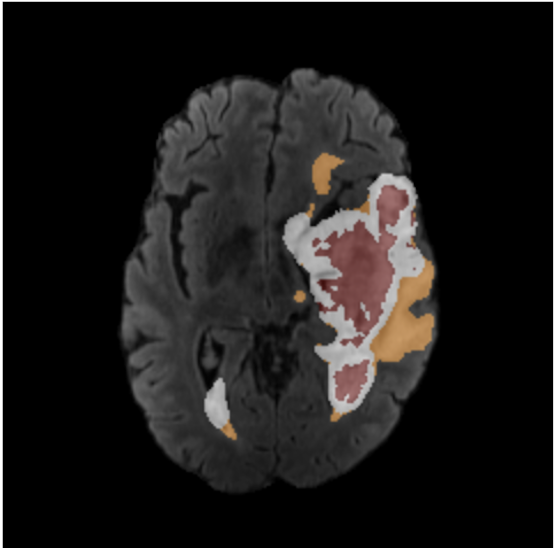

# BraTS2021 Image Quality Control Tool - Usage Guide

## Overview

This tool helps you quickly review and label brain MRI images from the BraTS dataset. It displays multiple MRI contrasts (T1, T1CE, T2, FLAIR) with tumor segmentation overlays, allowing you to mark images as "good", "bad", or leave them "unspecified".

**Quick Navigation:**
- For step-by-step instructions on how to install and use the tool, see: [Running the Tool](#running-the-tool)
- For in-depth instructions on keyboard navigation, see: [Keyboard Controls](#keyboard-controls)

---

## Required Software

- Bash shell (Mac/Linux native, or WSL on Windows)
- MINC toolkit (mincpik, mincstats, mincinfo, nii2mnc)
- ImageMagick (convert, montage, composite)
- GNU Parallel (optional but recommended for speed)

---

## Installation

### Full Conda Environment

```bash
conda env create -f environment.yml
conda activate minc
```

---

## Data Structure

Your BraTS data should be organized like this:

```
/path/to/brats_data/
├── BraTS-GLI-00000-000/
│   ├── BraTS-GLI-00000-000_t1.nii.gz (or .mnc)
│   ├── BraTS-GLI-00000-000_t1ce.nii.gz
│   ├── BraTS-GLI-00000-000_t2.nii.gz
│   ├── BraTS-GLI-00000-000_flair.nii.gz
│   └── BraTS-GLI-00000-000_seg.nii.gz
├── BraTS-GLI-00001-000/
│   └── ...
```

---

## Basic Usage

```bash
./BraTS2021_QualityControl.sh /path/to/brats_data
```

---

## Customization

Edit these parameters in the `show_image()` function:

- `crosshair_size=6` - Crosshair arm length (pixels)
- `line_width=1.5` - Crosshair line thickness
- `color="red"` - Crosshair color
- `slice_offset=15` - Distance between displayed slices

---

## Labelling Convention for BraTS2021

BraTS datasets have three non-zero labels:
- Edema
- Enhancing tumour
- Non-enhancing tumour and necrotic tissue

By default, this script uses the *hotmetal* colour map where:
- Orange = edema
- White = Enhancing tumour
- Red = Non-enhancing tumour AND necrotic tumour tissue



---

## Keyboard Controls

### Navigation
*Does not label images as "good" or "bad"*

- `→` (Right Arrow) - Next image
- `←` (Left Arrow) - Previous image

### Labeling

- `g` - Mark current image as "good" and advance
- `b` - Mark current image as "bad" and advance
- `u` - Undo last labeling action

### Display Options

- `m` - Toggle crosshair marker visibility on/off
-`p` - Toggle showing multiple images at once (by default, only show one)

### Filtering

- `1` - Show all images (default)
- `2` - Show only "good" images
- `3` - Show only "bad" images
- `4` - Show only "unspecified" images

### Exit

- `q` - Quit the viewer

---

## Running the Tool

### Step 1: Install Environment

If using conda, install the environment `minc` from the `environment.yml`, ie:

```bash
conda env create -f environment.yml
conda activate minc
```

Otherwise, manually install the packages specified in [Required Software](#required-software).

---

### Step 2: Determine Dataset of Choice


By convention, BraTS2021-2018 should contain N subfolders following the "BraTS-GLI-00000-000" naming convention. Each subfolder should contain five files (t1, t1ce, t2, flair, seg), of file type either `.nii.gz` or `.mnc`. The quality control script runs with either file type.

** There might be discrepancies in the naming convention of volume files in different versions of BraTS data. 

```
/path/to/brats_data/
├── BraTS-GLI-00000-000/
│   ├── BraTS-GLI-00000-000_t1.nii.gz (or .mnc)
│   ├── BraTS-GLI-00000-000_t1ce.nii.gz
│   ├── BraTS-GLI-00000-000_t2.nii.gz
│   ├── BraTS-GLI-00000-000_flair.nii.gz
│   └── BraTS-GLI-00000-000_seg.nii.gz
├── BraTS-GLI-00001-000/
│   └── ...
```


### Step 3: Navigate to Working Directory and Start the Viewer


To ensure efficient processing, the BraTS2021 Dataset images have been pre-loaded into the working directory. Therefore, to start the viewer for the BraTS2021 Dataset, just run:

```bash
cd BraTS_Evaluation
./BraTS2021_QualityControl.sh BraTS2021
```

```bash
cd BraTS_Evaluation
./BraTS2021_QualityControl.sh <dataset name> <./path/to/BraTS/directory>
```
This will generate the montage images (takes ~10 minutes on first run) for the new dataset version to be run. After the first run, it can be run as:

```bash
cd BraTS_Evaluation
./BraTS2021_QualityControl.sh <dataset name>
```

---

### Example Terminal Commands with BraTS2021

For example, BraTS2021 can be run the first time as:

```bash
cd BraTS_Evaluation
./BraTS2021_QualityControl.sh BraTS2021 ./path/to/BraTS2021_Training_Data
```
This will create the montage files for faster processing and will use/create the CSV file `BraTS2021_Evaluation.csv` which will store QC evaluations and display the first image.

Then on subsequent (runs), just run:

```bash
cd BraTS_Evaluation
./BraTS2021_QualityControl.sh BraTS2021
```

Note: Other versions have not been tested as thoroughly as BraTS2021 and may not work as expected (due to different file structures). Please [Contact](#contact) me for more support.
---


## Typical Workflow

### 1. Review the First Image

- Check all contrasts for artifacts, alignment, and quality
- Look at the segmentation overlay (rightmost column)
- To toggle crosshairs on/off, press `m` (see [Keyboard Controls](#keyboard-controls))

> **Labelling:** 
> Orange = edema (Peritumoral edema (Label 2))
> White = Enhancing tumour (Gadolinium-enhancing tumor (Label 4))
> Red = Non-enhancing tumour AND necrotic tumour tissue (NCR: Necrotic tumor core (Label 1))

> From BraTS:


### 2. Label the Image

- Press `g` if good quality → advances to next image
- Press `b` if bad quality → advances to next image
- Press `→` to skip without labeling

### 3. Use Filters to Review Specific Categories

> **Note:** These modes can be switched between without exiting the program
> 
> **Tip:** If continuing from a previous labeling session, press `4` to avoid relabeling previous work

- Press `1` to see all images ("good", "bad", "unlabeled") [default]
- Press `2` to verify all "good" images
- Press `3` to verify all "bad" images
- Press `4` to see only unlabeled images

### 4. Made a Mistake?

Press `u` to undo your last label and return to the previous image for re-evaluation.

### 5. Finish

Press `q` to quit.

Your labels are saved in `BraTS2021_Evaluation.csv`.

---

## Contact

If there are any issues, contact isabel.frolick@mail.mcgill.ca


## BraTS2021 Dataset

Multi-parametric MRI scans from 2000 patients were used for BraTS2021, 1251 of which were provided with segmentation labels to the participants for developing their algorithms, 219 of which were used for the public leaderboard during the validation phase, and the remaining 530 cases were intended for the private leaderboard and the final ranking of the participants. https://service.tib.eu/ldmservice/dataset/brats-2021

--- 
### Data Citation

	
Baid, U., Ghodasara, S., Mohan, S., Bilello, M., Calabrese, E., Colak, E., Farahani, K., Kalpathy-Cramer, J., Kitamura, F. C., Pati, S., Prevedello, L., Rudie, J., Sako, C., Shinohara, R., Bergquist, T., Chai, R., Eddy, J., Elliott, J., Reade, W., Schaffter, T., Yu, T., Zheng, J., Davatzikos, C., Mongan, J., Hess, C., Cha, S., Villanueva-Meyer, J., Freymann, J. B., Kirby, J. S., Wiestler, B., Crivellaro, P., Colen, R. R., Kotrotsou, A., Marcus, D., Milchenko, M., Nazeri, A., Fathallah-Shaykh, H., Wiest, R., Jakab, A., Weber, M-A., Mahajan, A., Menze, B., Flanders, A E., Bakas, S., (2023) RSNA-ASNR-MICCAI-BraTS-2021 Dataset. The Cancer Imaging Archive DOI: 10.7937/jc8x-9874 

